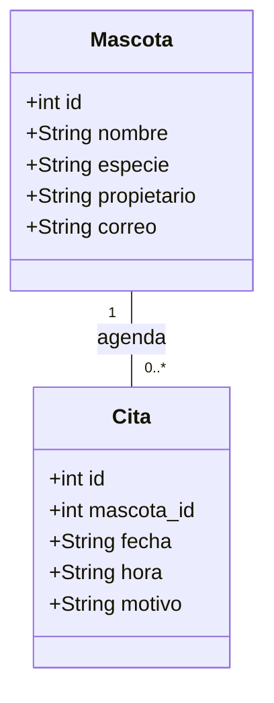
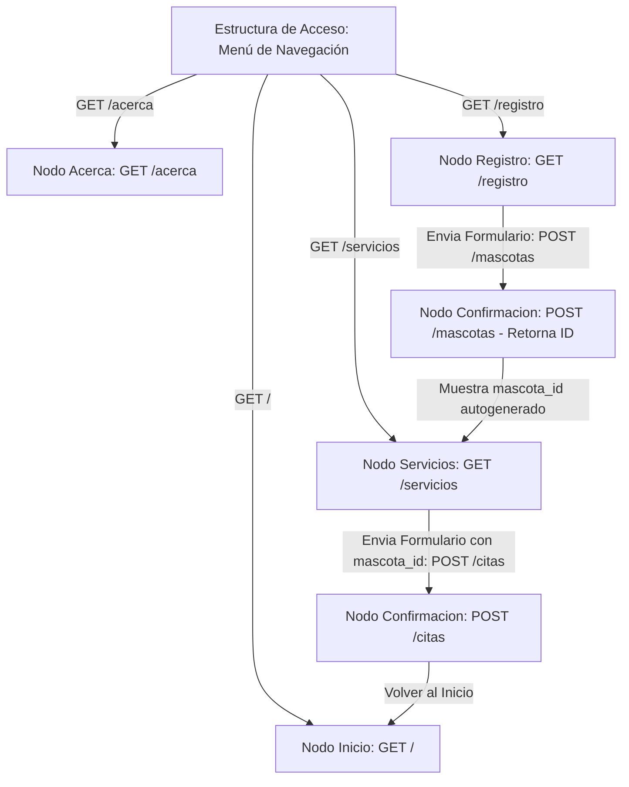
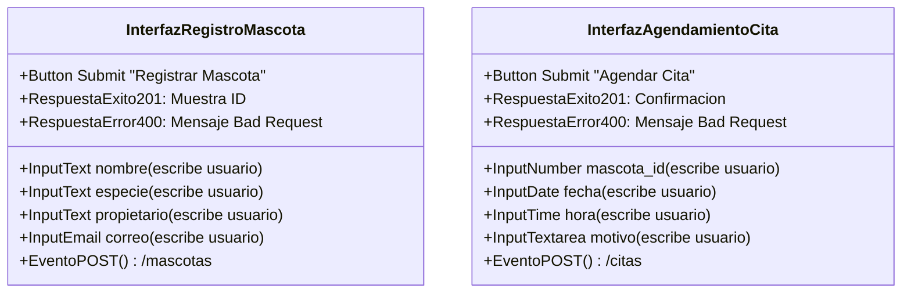
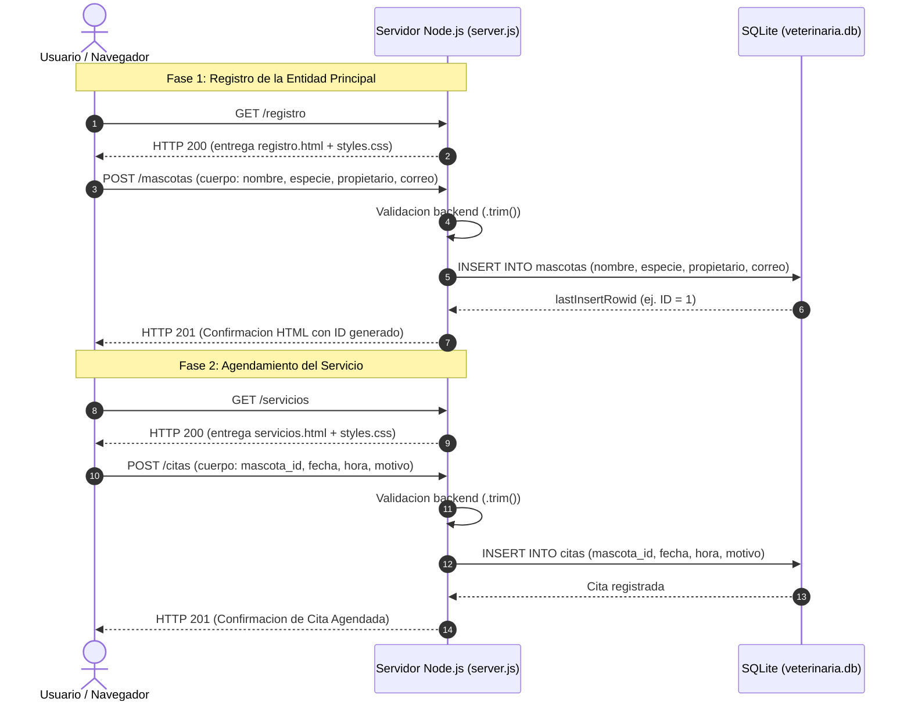

# Metodología OOHDM Aplicada a la Plataforma Veterinaria

**Proyecto:** Práctica Evaluativa (10%) — Aplicación de OOHDM  
**Estudiante:** Mariana Atehortua Grajales  
**Asignatura:** Ingeniería Web  
**Programa:** Ingeniería de Software  
**Institución:** Universidad Cooperativa de Colombia  
**Temática Asignada:** Clínica Veterinaria  

---

## 1. Introducción
El objetivo de este documento es aplicar la metodología **OOHDM** (*Object-Oriented Hypermedia Design Method*) a la plataforma de la **Clínica Veterinaria**. Este método permite pasar de la abstracción del dominio del problema a la navegación del usuario, la especificación abstracta de la interfaz y la arquitectura final de software.

---

## 2. Los Cuatro Modelos OOHDM

### 2.1 Modelo Conceptual (Diseño Conceptual)
*¿Qué información maneja la plataforma y cómo se relaciona?*

El modelo conceptual define las entidades de dominio asignadas a la temática de **Clínica Veterinaria**: `Mascota` (entidad principal) y `Cita` (operación o servicio asociado).

#### Reglas de Negocio del Dominio:
- Una **Mascota** es registrada por su propietario con sus datos de contacto.
- Una **Mascota** puede tener agendadas **0 a muchas (0..*) Citas** médicas clínicas.
- Cada **Cita** médica pertenece estrictamente a **1 Mascota** registrada previa y obligatoriamente.

#### Diagrama de Clases Conceptuales:

---

### 2.2 Modelo Navegacional (Diseño Navegacional)
*¿Qué nodos visita el usuario y cómo se desplaza entre ellos?*

Describe los nodos del hipermedio que visita el usuario, las estructuras de acceso (menú principal) y cómo se transporta el identificador único `id` de la mascota entre el registro y el agendamiento del servicio.

#### Estructura de Nodos y Rutas:
1. **Nodo Inicio (`GET /`):** Punto de entrada e información general.
2. **Nodo Acerca de (`GET /acerca`):** Información contextual del proyecto.
3. **Nodo Registro (`GET /registro`):** Formulario para registrar la entidad `Mascota`.
4. **Nodo Confirmación Registro (`POST /mascotas`):** Muestra el `id` asignado a la mascota (`lastInsertRowid`).
5. **Nodo Servicios (`GET /servicios`):** Formulario para agendar la `Cita` médica solicitando el `mascota_id`.
6. **Nodo Confirmación Cita (`POST /citas`):** Muestra el resultado de la cita almacenada para esa mascota.

#### Diagrama Navegacional:

---

### 2.3 Modelo de Interfaz Abstracta (Diseño de Interfaz Abstracta)
*¿Qué información, controles y respuestas contiene cada nodo?*

Este modelo representa los elementos perceptibles de los dos formularios principales sin evaluar decisiones cromáticas o tipográficas.

#### Especificación de Controles e Interacción:

#### Comportamiento frente a respuestas:
- **Respuesta 201 (Created):** Se activa cuando todos los campos están completos y la inserción en SQLite es exitosa.
- **Respuesta 400 (Bad Request):** Se activa en el backend si algún campo de texto recibido tras aplicar `.trim()` resulta vacío.

---

### 2.4 Modelo de Implementación
*¿Cómo se materializan los modelos anteriores mediante tecnologías concretas?*

Representa la arquitectura física ejecutada mediante el navegador web, el servidor nativo Node.js y la base de datos relacional SQLite (`veterinaria.db`).

#### Diagrama de Arquitectura e Implementación:

---

## 3. Matriz de Correspondencia Trazable

Esta matriz rastrea cada abstracción de los modelos OOHDM con su respectivo código, ruta, tabla y evidencia funcional dentro del proyecto.

| Elemento OOHDM | Ruta o Archivo | Tabla o Campo | Evidencia Funcional |
|---|---|---|---|
| **Entidad Principal** | `POST /mascotas` en `server.js` | Tabla `mascotas` (`nombre`, `especie`, `propietario`, `correo`) | Registro almacenado en SQLite e `id` autogenerado mostrado en pantalla. |
| **Operación o Servicio** | `POST /citas` en `server.js` | Tabla `citas` (`mascota_id`, `fecha`, `hora`, `motivo`) | Operación almacenada e insertada asociando la columna `mascota_id`. |
| **Nodo de Registro** | `GET /registro` (`registro.html`) | No Aplica | Formulario HTML semántico presentado al usuario con estilos externos. |
| **Nodo de Servicios** | `GET /servicios` (`servicios.html`) | No Aplica | Formulario HTML presentado para agendamiento solicitando el ID de la mascota. |
| **Evento de Envío** | `POST /mascotas` y `POST /citas` | `INSERT INTO mascotas` y `INSERT INTO citas` | Sentencias preparadas con `?`, respuesta `201 Created` o `400 Bad Request`. |